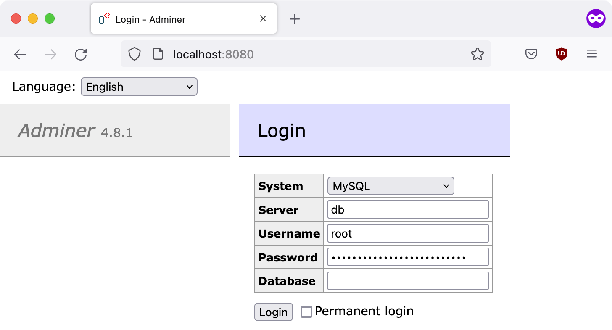
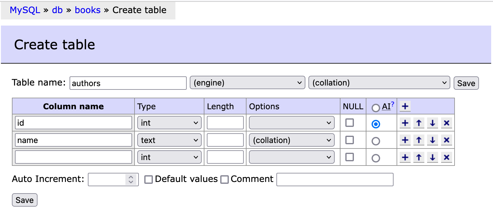
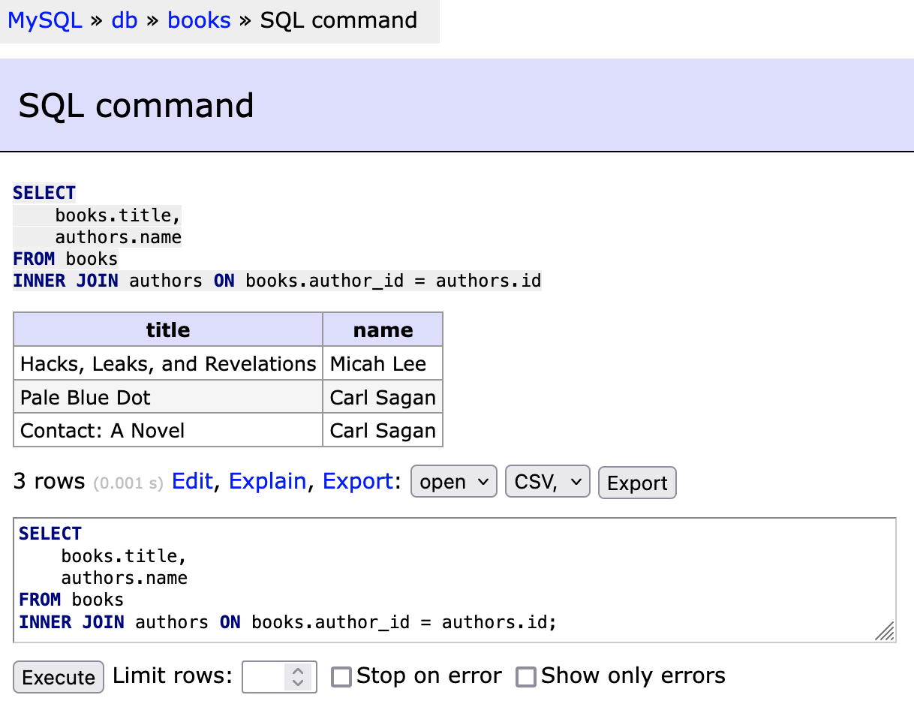

# Exercise 12-1: Create and Test a MySQL Server Using Docker and Adminer

In this exercise you'll run a MySQL server on your computer using Docker Compose.

## Run the Server

Create a folder for this exercise, and create a `docker-compose.yaml` file in it that has this content:

```yaml
version: '3.9'

services:

  db:
    image: mariadb:10.8
    restart: always
    environment:
      MARIADB_ROOT_PASSWORD: this-is-your-root-password
      MARIADB_ROOT_HOST: "%"
    ports:
      - 3306:3306
    volumes:
      - ./db_data:/var/lib/mysql

  adminer:
    image: adminer
    restart: always
    ports:
      - 8080:8080
```

The root password is set to `this-is-your-root-password`, but feel free to change it to whatever you want. This will also save all of the MySQL data into a folder called `db_data`, in the same folder as the `docker-compose.yaml` file. Make sure you choose a folder with enough disk space, like on your datasets USB disk.

Open a terminal, change to this exercise folder, and run:

```sh
docker-compose up
```

For example:

```
micah@trapdoor chapter-12 % docker-compose up
Creating network "chapter-12_default" with the default driver
Pulling db (mariadb:10.8)...
10.8: Pulling from library/mariadb
405f018f9d1d: Pull complete
--snip--
Creating chapter-12_db_1      ... done
Creating chapter-12_adminer_1 ... done
Attaching to chapter-12_db_1, chapter-12_adminer_1
adminer_1  | [Fri Jun 10 20:30:31 2022] PHP 7.4.30 Development Server (http://[::]:8080) started
db_1       | 2022-06-10 20:30:31+00:00 [Note] [Entrypoint]: Entrypoint script for MariaDB Server 1:10.8.3+maria~jammy started.
db_1       | 2022-06-10 20:30:32+00:00 [Note] [Entrypoint]: Switching to dedicated user 'mysql'
db_1       | 2022-06-10 20:30:32+00:00 [Note] [Entrypoint]: Entrypoint script for MariaDB Server 1:10.8.3+maria~jammy started.
db_1       | 2022-06-10 20:30:32+00:00 [Note] [Entrypoint]: Initializing database files
--snip--
db_1       | 2022-06-10 20:30:41 0 [Note] mariadbd: ready for connections.
db_1       | Version: '10.8.3-MariaDB-1:10.8.3+maria~jammy'  socket: '/run/mysqld/mysqld.sock'  port: 3306  mariadb.org binary distribution
```

## Connect to Database With Adminer

When the containers finish starting, load http://localhost:8080 in your browser to access Adminer, a MySQL client. Login with the `root` user and the password you set in the `docker-compose.yaml` file. Leave the Database field blank.



## Create a Test Database and Add Test Data

Leave the default databases alone (`information_schema`, `mysql`, `performance_schema`, and `sys`), and instead create a new database to work with.

Click the "Create database" link, and create a new database called `books`.

Inside this database, click the "Create table" link and make a new table called `authors`. Give it these columns:

- `id`, with type `int`, and check the "AI" radio button, which sets this column to auto-increment
- `name`, with type `text`

It should look like this:



Go back to the `books` table and click the "Create table" link again, this time making a new table called `books`. Give it these columns:

- `id`, with type `int` and with "AI" checked
- `title`, with type`text`
- `author_id` -- Adminer is smart enough to determine that this column uses type `int` and relates to the `authors.id` column, so it will automatically set the type as `authors`

It should look like this:


Click "SQL command" to run SQL commands, and copy and paste these SQL queries to insert the initial data into these two tables:

```sql
INSERT INTO authors (name) VALUES ('Micah Lee');
INSERT INTO authors (name) VALUES ('Carl Sagan');
INSERT INTO books (title, author_id) VALUES ('Hacks, Leaks, and Revelations', 1);
INSERT INTO books (title, author_id) VALUES ('Pale Blue Dot', 2);
INSERT INTO books (title, author_id) VALUES ('Contact: A Novel', 2);
```

Now that there's data, you can run queries on it. Try running this one:

```sql
SELECT
    books.title,
    authors.name
FROM books
INNER JOIN authors ON books.author_id = authors.id;
```

It should look like this:

