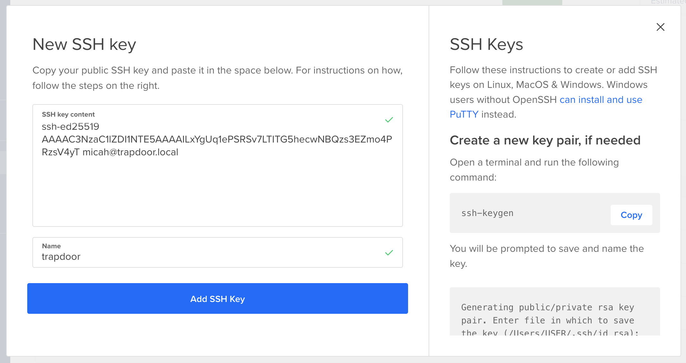

# Homework 5-4: Create a VPS

You can use whatever cloud provider you'd like. I used [DigitalOcean](https://www.digitalocean.com/).

## Generate an SSH Key

```sh
ssh-keygen -t ed25519
```

For example:

```
micah@trapdoor ~ % ssh-keygen -t ed25519
Generating public/private ed25519 key pair.
Enter file in which to save the key (/Users/micah/.ssh/id_ed25519):   
Created directory '/Users/micah/.ssh'.
Enter passphrase (empty for no passphrase): 
Enter same passphrase again: 
Your identification has been saved in /Users/micah/.ssh/id_ed25519
Your public key has been saved in /Users/micah/.ssh/id_ed25519.pub
The key fingerprint is:
SHA256:aGu314jS+mmmP8izQkJwkyZUEFvYp9h0Su2Sj3xq7/w micah@trapdoor.local
The key's randomart image is:
+--[ED25519 256]--+
|.+*+.            |
|o.B+ +           |
| *=.B            |
| ..* . .         |
| .. + o S        |
|  .o.+ .         |
|   oo.oo.. o     |
|   oo.=.*oo .    |
|  . o==E=o       |
+----[SHA256]-----+
```

## Add Your Public Key to The Cloud Provider

View your public key:

```sh
cat ~/.ssh/id_ed25519.pub
```

For example:

```
micah@trapdoor ~ % cat ~/.ssh/id_ed25519.pub
ssh-ed25519 AAAAC3NzaC1lZDI1NTE5AAAAILxYgUq1ePSRSv7LTITG5hecwNBQzs3EZmo4PRzsV4yT micah@trapdoor.local
```

Add it to DigitalOcean:



## Create a VPS

Create a new VPS (a "Droplet", in DigitalOcean) with these settings:

- Choose an image: Ubuntu
- Choose a plan: Shared CPU > Basic, and pick the cheapest option
- Add block storage: you can skip this
- Choose a datacenter region: the choice is yours, but I picked Singapore
- “Authentication: choose “SSH keys” and select the SSH key that you just added
- Select additional options: check the box next to Monitoring
- Finalize and create: choose one droplet, and give it a hostname like `test-vps`

Wait for it to finish and then copy the IP address. For example, my IP address is 
When DigitalOcean is done provisioning my VPS, it tells me the IP address is `178.128.22.151`.


## SSH to Your Server

You ssh to a server using `ssh username@hostname`. Since I'm using DigitalOcean, I'm SSHing as the `root` user, so my command is:

```sh
ssh root@178.128.22.151
```

Example:

```
micah@trapdoor ~ % ssh root@178.128.22.151
The authenticity of host '178.128.22.151 (178.128.22.151)' can't be established.
ED25519 key fingerprint is SHA256:062oSOXq+G1sGLIzoQdFnQvJE/BU8GLLWnNr5WUOmAs.
This key is not known by any other names
Are you sure you want to continue connecting (yes/no/[fingerprint])? yes
Warning: Permanently added '178.128.22.151' (ED25519) to the list of known hosts.
Enter passphrase for key '/Users/micah/.ssh/id_ed25519': 
Welcome to Ubuntu 22.04 LTS (GNU/Linux 5.15.0-41-generic x86_64)

 * Documentation:  https://help.ubuntu.com
 * Management:     https://landscape.canonical.com
 * Support:        https://ubuntu.com/advantage

  System information as of Sat Aug 13 00:20:54 UTC 2022

  System load:  0.3046875         Users logged in:       0
  Usage of /:   6.4% of 24.05GB   IPv4 address for eth0: 178.128.22.151
  Memory usage: 23%               IPv4 address for eth0: 10.15.0.5
  Swap usage:   0%                IPv4 address for eth1: 10.104.0.2
  Processes:    97

27 updates can be applied immediately.
13 of these updates are standard security updates.
To see these additional updates run: apt list --upgradable


The programs included with the Ubuntu system are free software;
the exact distribution terms for each program are described in the
individual files in /usr/share/doc/*/copyright.

Ubuntu comes with ABSOLUTELY NO WARRANTY, to the extent permitted by
applicable law.

root@test-vps:~# 
```

## Start a Byobu Session

```sh
byobu
```

Example:


Press CTRL-A to open a new Byobu window. Check out https://www.byobu.org for further documentation.

## Install updates

I don't need to use `sudo` because I'm logged in directly as the root user.

```sh
apt update
apt upgrade
```

Example:

```
root@test-vps:~# apt update
Hit:1 http://mirrors.digitalocean.com/ubuntu jammy InRelease
Hit:2 https://repos.insights.digitalocean.com/apt/do-agent main InRelease                                                                                    
Hit:3 https://repos-droplet.digitalocean.com/apt/droplet-agent main InRelease                                                                                
Hit:4 http://mirrors.digitalocean.com/ubuntu jammy-updates InRelease                               
Hit:5 http://mirrors.digitalocean.com/ubuntu jammy-backports InRelease       
Hit:6 http://security.ubuntu.com/ubuntu jammy-security InRelease             
Reading package lists... Done
Building dependency tree... Done
Reading state information... Done
29 packages can be upgraded. Run 'apt list --upgradable' to see them.
W: https://repos.insights.digitalocean.com/apt/do-agent/dists/main/InRelease: Key is stored in legacy trusted.gpg keyring (/etc/apt/trusted.gpg), see the DEPRECATION section in apt-key(8) for details.
root@test-vps:~# apt upgrade
Reading package lists... Done
Building dependency tree... Done
Reading state information... Done
Calculating upgrade... Done
The following NEW packages will be installed:
  linux-headers-5.15.0-46 linux-headers-5.15.0-46-generic linux-image-5.15.0-46-generic linux-modules-5.15.0-46-generic
The following packages have been kept back:
  python3-software-properties software-properties-common
The following packages will be upgraded:
  base-files cryptsetup cryptsetup-bin cryptsetup-initramfs libc-bin libc6 libcryptsetup12 libfreetype6 libgnutls30 libgstreamer1.0-0 libnetplan0
  libtirpc-common libtirpc3 linux-headers-generic linux-headers-virtual linux-image-virtual linux-virtual locales motd-news-config netplan.io
  python-apt-common python3-apt python3-distupgrade python3-gi python3-jwt snapd ubuntu-release-upgrader-core
27 upgraded, 4 newly installed, 0 to remove and 2 not upgraded.
9 standard security updates
Need to get 84.0 MB of archives.
After this operation, 237 MB of additional disk space will be used.
Do you want to continue? [Y/n] y
Get:1 http://mirrors.digitalocean.com/ubuntu jammy-updates/main amd64 motd-news-config all 12ubuntu4.2 [4612 B]
Get:2 http://mirrors.digitalocean.com/ubuntu jammy-updates/main amd64 libc6 amd64 2.35-0ubuntu3.1 [3235 kB]
Get:3 http://mirrors.digitalocean.com/ubuntu jammy-updates/main amd64 base-files amd64 12ubuntu4.2 [62.7 kB]
Get:4 http://mirrors.digitalocean.com/ubuntu jammy-updates/main amd64 libc-bin amd64 2.35-0ubuntu3.1 [706 kB]       
--snip--
```

After installing updates, you might need to reboot:

```sh
reboot
```