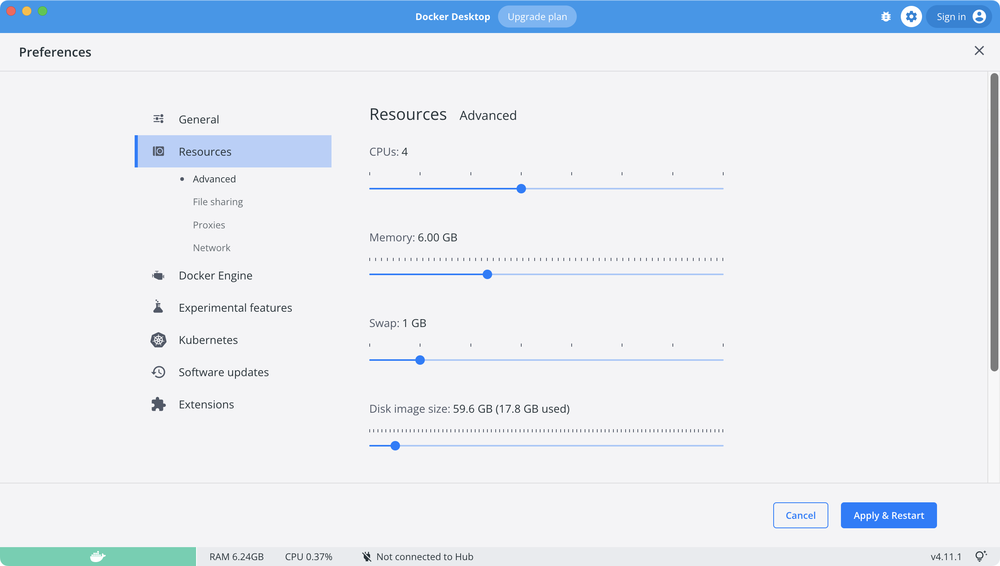

# Homework 5-1 for Windows and Mac Users: Install Docker Desktop

Download and install [Docker Desktop](https://www.docker.com/products/docker-desktop) for Windows or Mac.

If you're using a newer Mac with an M1 or M2 chip, make sure to choose "Mac with Apple Chip." Otherwise choose "Mac with Intel Chip."

After opening Docker Desktop for the first time and waiting for it to start, open a terminal (if you're using Windows, use PowerShell). See if it works by running:

```sh
docker run hello-world
```

Example:

```
micah@trapdoor ~ % docker run hello-world
Unable to find image 'hello-world:latest' locally
latest: Pulling from library/hello-world
2db29710123e: Pull complete
Digest: sha256:97a379f4f88575512824f3b352bc03cd75e239179eea0fecc38e597b2209f49a
Status: Downloaded newer image for hello-world:latest

Hello from Docker!
This message shows that your installation appears to be working correctly.

To generate this message, Docker took the following steps:
 1. The Docker client contacted the Docker daemon.
 2. The Docker daemon pulled the "hello-world" image from the Docker Hub.
    (amd64)
 3. The Docker daemon created a new container from that image which runs the
    executable that produces the output you are currently reading.
 4. The Docker daemon streamed that output to the Docker client, which sent it
    to your terminal.

To try something more ambitious, you can run an Ubuntu container with:
 $ docker run -it ubuntu bash

Share images, automate workflows, and more with a free Docker ID:
 https://hub.docker.com/

For more examples and ideas, visit:
 https://docs.docker.com/get-started/

micah@trapdoor ~ %
```

If you're using a Mac, make sure that Docker Desktop's Linux VM has enough memory to handle Aleph. Click the Docker icon in your system tray and choose Preferences. Switch to the Resources tab, and make sure that the Memory resource is set to at least 6GB, or more if you have more to spare. Then click Apply & Restart.

